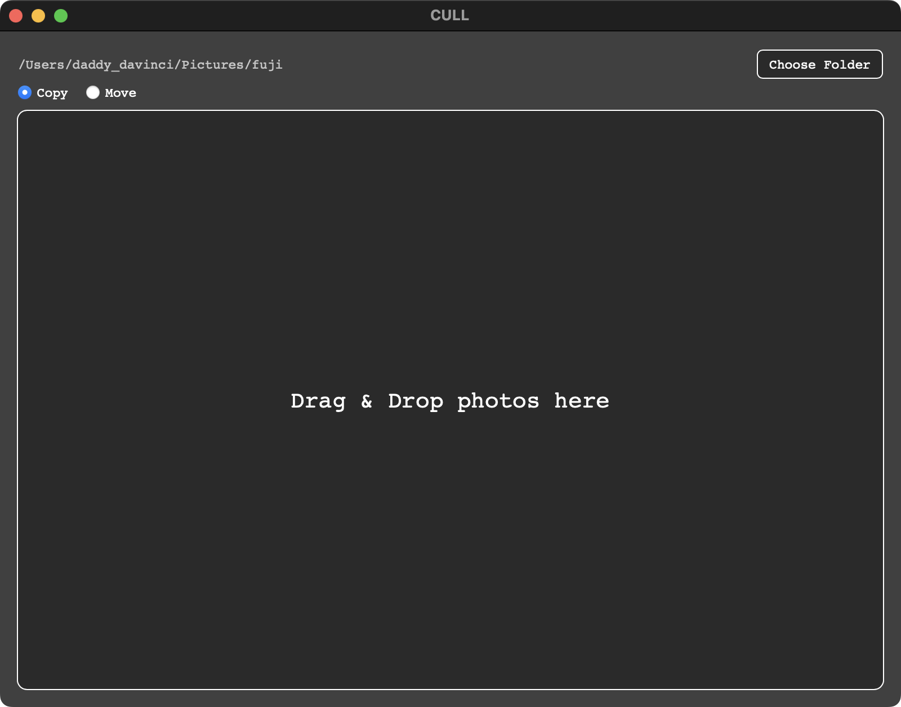

# cull

Drop photos in. Get them sorted by date. That's it.



---

**Download** the latest binary from [Releases](https://github.com/harmeepatel/cull/releases) — macOS (Apple Silicon + Intel), Windows (64 + 32-bit), Linux.

---

## Usage

1. Pick a destination folder
2. Choose **Copy** or **Move**
3. Drag & drop your photos
4. Done — sorted into `Year / Month / Day`

Reads EXIF date if available, falls back to file modified date. Handles duplicates automatically.

**Formats:** JPEG, PNG, HEIC, WebP, TIFF, AVIF + RAW (RAF, ARW, CR2/3, NEF, DNG, ORF, RW2, PEF...)

---

## Build from source

```sh
cargo install dioxus-cli
git clone https://github.com/harmeepatel/cull
cd cull
dx serve --release
```

Linux also needs: `libwebkit2gtk-4.1-dev libgtk-3-dev libayatana-appindicator3-dev librsvg2-dev`
